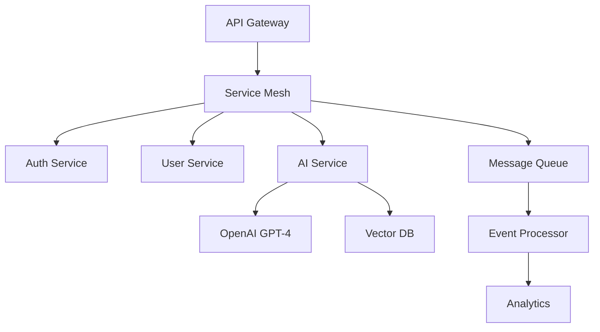

# Hi there, I'm Utopia Dev! 👋

<div align="center">
  
</div>

## 🚀 About Me

> Passionate software architect and polyglot engineer with expertise in building scalable, distributed systems and AI-powered applications.

- 🔭 **Current Focus:** Building next-gen AI applications with OpenAI GPT-4, LangChain, and vector databases
- 🏗️ **Architecture:** Microservices, Event-Driven Systems, Serverless, DDD, CQRS
- 🌱 **Exploring:** Rust for systems programming, WebAssembly, Edge Computing, Quantum Computing basics
- 💡 **Philosophy:** Write code that humans can understand, optimize for maintainability
- 🎯 **Mission:** Architect solutions that scale from MVP to millions of users
- ⚡ **Fun fact:** I debug in production (with proper monitoring, rollback strategies, and feature flags)

## 🛠️ Tech Stack

### Programming Languages

<div align="center">


</div>

### Backend Frameworks & Runtimes

<div align="center">

**Java Ecosystem**
  


**Python Ecosystem**


**Node.js Ecosystem**


**Other**


</div>

### Frontend & Modern JavaScript Frameworks

<div align="center">

**Mainstream**


**Modern & Emerging**


**Specialized Libraries**


</div>

### AI/ML & OpenAI Ecosystem

<div align="center">


</div>

### Databases & Data Stores

<div align="center">

**SQL**


**NoSQL**


**Vector & Graph**


</div>

### Cloud & DevOps

<div align="center">


</div>

### Message Brokers & Event Streaming

<div align="center">


</div>

### Tools & IDEs

<div align="center">


</div>

## 📊 GitHub Stats

<div align="center">
  
</div>

<div align="center">
  
</div>

## 🏆 GitHub Trophies

<div align="center">
  
</div>

## 📈 Activity Graph

<div align="center">
  
</div>

## 🎯 Current Focus

```typescript
interface SeniorDeveloper {
  name: string;
  title: string;
  specializations: string[];
  architecturePatterns: string[];
  aiFrameworks: OpenAIStack;
  currentProjects: Project[];
}

interface OpenAIStack {
  models: string[];
  frameworks: string[];
  vectorDatabases: string[];
  techniques: string[];
}

interface Project {
  name: string;
  stack: string[];
  scale: string;
  challenges: string[];
}

const utopia: SeniorDeveloper = {
  name: "Utopia Dev",
  title: "Senior Software Architect & AI Engineer",
  specializations: [
    "Distributed Systems Architecture",
    "AI/ML Integration (OpenAI GPT-4, Claude)",
    "Event-Driven Microservices",
    "High-Performance Computing",
    "Real-time Data Processing"
  ],
  architecturePatterns: [
    "Domain-Driven Design (DDD)",
    "CQRS & Event Sourcing",
    "Hexagonal Architecture",
    "Microservices",
    "Serverless",
    "Strangler Fig Pattern"
  ],
  aiFrameworks: {
    models: ["GPT-4", "GPT-4 Turbo", "Claude 3.5 Sonnet", "Llama 3", "Gemini Pro"],
    frameworks: ["LangChain", "LlamaIndex", "Semantic Kernel", "AutoGen", "CrewAI"],
    vectorDatabases: ["Pinecone", "Weaviate", "Qdrant", "Chroma", "Milvus"],
    techniques: [
      "RAG (Retrieval-Augmented Generation)",
      "Fine-tuning & Transfer Learning",
      "Prompt Engineering & Chain-of-Thought",
      "Function Calling & Tool Use",
      "Embeddings & Semantic Search"
    ]
  },
  currentProjects: [
    {
      name: "Enterprise AI Platform",
      stack: ["Python", "FastAPI", "OpenAI GPT-4", "LangChain", "Pinecone", "React", "TypeScript"],
      scale: "Processing 10M+ queries/day",
      challenges: ["Context window optimization", "Streaming responses", "Cost optimization"]
    },
    {
      name: "Real-time Analytics Dashboard",
      stack: ["GoJS", "React", "D3.js", "Spring Boot", "Kafka", "Cassandra", "Redis"],
      scale: "Handling 1M events/second",
      challenges: ["Sub-50ms latency", "Real-time data aggregation", "Interactive visualizations"]
    },
    {
      name: "Cloud-Native Microservices Platform",
      stack: ["Java", "Quarkus", "Kubernetes", "Istio", "ArgoCD", "Prometheus", "Grafana"],
      scale: "300+ microservices across 5 regions",
      challenges: ["Service mesh optimization", "Observability at scale", "Zero-downtime deployments"]
    }
  ]
};

// Philosophy
const principles = {
  code: "Code is read 10x more than it's written - optimize for readability",
  architecture: "Design for failure, implement circuit breakers everywhere",
  ai: "LLMs are tools, not magic - understand their limitations and strengths",
  scaling: "Premature optimization is evil, but know when to scale",
  testing: "If it's not tested in production, it's not tested (with proper safeguards)"
};
```


## 💭 Quote of the Day

<div align="center">
  


</div>

## 🏗️ Architecture & Design Patterns

### Microservices Architecture


### Key Expertise Areas

**System Design & Architecture**
- 🔹 Designing systems that scale from 0 to 100M users
- 🔹 Event-driven architectures with Kafka, RabbitMQ, Pulsar
- 🔹 CQRS & Event Sourcing patterns for complex domains
- 🔹 API Gateway patterns (Rate limiting, Circuit breakers, Bulkheads)
- 🔹 Database sharding, replication strategies, and polyglot persistence

**AI/ML Integration**
- 🤖 Building production RAG systems with OpenAI GPT-4 & Claude
- 🤖 Implementing semantic search with vector databases
- 🤖 Fine-tuning LLMs for domain-specific tasks
- 🤖 Prompt engineering and chain-of-thought reasoning
- 🤖 AI cost optimization (caching, compression, model selection)

**Performance & Scalability**
- ⚡ Sub-50ms API response times at scale
- ⚡ Horizontal scaling strategies and auto-scaling
- ⚡ Caching strategies (Redis, CDN, in-memory)
- ⚡ Database query optimization and indexing
- ⚡ Load testing and capacity planning

**Security & Compliance**
- 🔒 OAuth 2.0, JWT, mTLS implementations
- 🔒 Zero-trust architecture principles
- 🔒 GDPR, SOC 2, HIPAA compliance experience
- 🔒 Security scanning and vulnerability management
- 🔒 Secrets management (HashiCorp Vault, AWS Secrets Manager)

## 🚀 Featured Projects & Use Cases

### 1. **AI-Powered Code Assistant** 
*Tech: Python, FastAPI, OpenAI GPT-4, LangChain, PostgreSQL, React*

Built an enterprise code assistant that helps developers write better code through:
- Real-time code analysis and suggestions
- Natural language to code generation
- Automatic documentation generation
- Code review automation with GPT-4

**Results:** 40% reduction in code review time, 25% fewer production bugs

### 2. **Real-Time Data Visualization Platform**
*Tech: GoJS, React, TypeScript, Java Spring Boot, Apache Kafka, Cassandra*

Developed interactive diagram and flowchart platform using GoJS for:
- Real-time network topology visualization
- Business process modeling (BPMN)
- Organizational charts with live data
- Custom node templates and interactive editing

**Results:** Handling 1M+ diagram operations/day, <50ms rendering time

### 3. **Distributed E-commerce Platform**
*Tech: Java, Spring Boot, Kubernetes, Kafka, PostgreSQL, Redis, Next.js*

Architected and built a microservices-based e-commerce platform:
- 50+ microservices using Domain-Driven Design
- Event-driven order processing with Kafka
- Real-time inventory management
- Multi-region deployment with Kubernetes

**Results:** 10M+ transactions/month, 99.99% uptime

### 4. **Enterprise AI Chat Platform**
*Tech: Python, FastAPI, OpenAI GPT-4, Pinecone, LangChain, WebSockets, Vue.js*

Created an intelligent chat platform with:
- Context-aware responses using RAG
- Multi-document Q&A with semantic search
- Conversation memory and context management
- Real-time streaming responses

**Results:** 5M+ conversations processed, 95% user satisfaction

## 📚 Technical Writing & Speaking

- 📝 **Blog:** [technical-insights.dev](https://example.com) - 100K+ monthly readers
- 🎤 **Conference Talks:** Speaker at JavaOne, PyCon, React Summit
- 📖 **Open Source:** 50+ contributions to major projects (Spring, React, TensorFlow)
- 🎓 **Mentorship:** Mentored 20+ junior developers into senior roles

## 🎓 Certifications & Learning

```python
certifications = {
    "cloud": [
        "AWS Solutions Architect Professional",
        "Google Cloud Professional Architect",
        "Azure Solutions Architect Expert"
    ],
    "kubernetes": [
        "Certified Kubernetes Administrator (CKA)",
        "Certified Kubernetes Application Developer (CKAD)"
    ],
    "security": [
        "CISSP (Certified Information Systems Security Professional)",
        "CEH (Certified Ethical Hacker)"
    ],
    "ai_ml": [
        "TensorFlow Developer Certificate",
        "Deep Learning Specialization (Coursera)"
    ],
    "languages": {
        "java": ["Oracle Certified Professional, Java SE 17 Developer"],
        "python": ["PCAP - Certified Associate in Python Programming"]
    }
}
```

## 🤝 Let's Connect!

I'm always interested in collaborating on interesting projects, especially in:
- 🤖 AI/ML applications and LLM integration
- 🏗️ Distributed systems and microservices architecture
- ⚡ High-performance computing and optimization
- 🌐 Open source projects that make a difference

**Open to:**
- Technical consulting and architecture reviews
- Speaking at conferences and meetups
- Open source collaborations
- Mentoring aspiring developers

---

<div align="center">
  
  
  ### 💼 Available for consulting and collaboration opportunities
  ### ⭐ Show some support by starring the repositories you find interesting!
  
</div>


